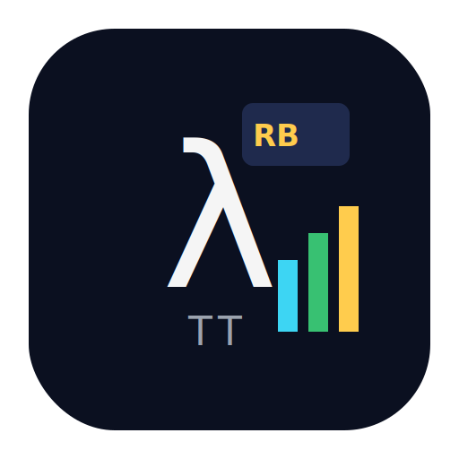

<svg xmlns="http://www.w3.org/2000/svg" width="1512" height="1512" viewBox="0 0 512 512">
  <!-- Background -->
  <rect x="32" y="32" width="448" height="448" rx="96" ry="96" fill="#0b1020"/>
  <!-- Lambda -->
  <text x="180" y="320" font-family="Iosevka, Menlo, Consolas, monospace"
        font-size="220" fill="#f5f5f5">λ</text>
  <!-- RB tag -->
  <rect x="270" y="115" width="120" height="70" rx="12" ry="12" fill="#1f2a4d"/>
  <text x="282" y="163" font-family="Iosevka, Menlo, Consolas, monospace"
        font-weight="600" font-size="34" fill="#ffcc4d">RB</text>
  <!-- Cost bars -->
  <rect x="310" y="290" width="22" height="80" fill="#3dd5f3"/>
  <rect x="344" y="260" width="22" height="110" fill="#38c172"/>
  <rect x="378" y="230" width="22" height="140" fill="#ffcc4d"/>
  <!-- Caption TT -->
  <text x="210" y="385" font-family="Iosevka, Menlo, Consolas, monospace"
        font-size="44" letter-spacing="6" fill="#9ca3af">TT</text>
</svg>

# RB-TT — Resource-Bounded Type Theory



Resource-Bounded Type Theory (RB-TT) is a small typed λ-calculus for **compositional cost analysis**.

Terms are typed with synthesized bounds drawn from an abstract **resource lattice**  
\((L, \preceq, \oplus, \bot)\), and a graded **feasibility modality** □ᵣ tracks which programs are
admissible under a given resource budget.

The project contains:

- the **core calculus** (syntax, typing, and operational cost semantics),
- a **syntactic cost soundness theorem** (“typed bound ≥ operational cost”),
- a **presheaf-style model** in `Set^L` (in the accompanying paper `RB_TT.pdf`), and
- a **Lean 4 formalization** of the syntactic system and examples (e.g. binary search).

> 📄 The companion paper lives in `RB_TT.pdf` and is the canonical specification of the system.

---

## Features

- **Abstract resource lattice**  
  Treat time, steps, gas, memory, or domain-specific quantities uniformly via \((L, \preceq, \oplus, \bot)\).

- **Graded feasibility modality `□ᵣ`**  
  Express that a computation is feasible under budget `r`, with counit and monotonicity laws.

- **Compositional cost bounds**  
  Typing rules synthesize bounds `b` for terms; application, pairing, conditionals, etc. combine bounds
  via `⊕` and lattice joins.

- **Syntactic cost soundness**  
  If a closed term is typable with bound `b` under budget `r`, then its operational cost is bounded by `b`
  in the chosen cost model.

- **Lean 4 development**  
  The core calculus, operational semantics, and example bounds are mechanized in Lean 4
  and organized as a Lake project.

---

## Getting started

### Prerequisites

- [Lean 4](https://leanprover.github.io/) (matching the version in `lean-toolchain`)
- Lake (Lean’s build tool, included with recent Lean 4 installs)
- A recent `git`

Optional but recommended:

- VS Code + Lean 4 extension for interactive exploration.

### Clone and build

```bash
git clone https://github.com/CoreyThuro/RB-TT.git
cd RB-TT

# Fetch dependencies and build
lake build
```

If you use VS Code, just open the `RB-TT` folder and the Lean extension will pick up
the `lean-toolchain` and `lakefile.lean`. Wait for the project to finish building, then
you can jump through definitions and theorems interactively.

---

## Repository layout

At a high level:

- `RB_TT.pdf` – main paper describing the theory and semantics.
- `src/` – Lean 4 source:
  - core syntax and typing rules for RB-TT,
  - operational semantics with cost,
  - key theorems (preservation, progress, and cost soundness),
  - example developments.
- `demo/` – demo scripts / Lean files illustrating end-to-end cost reasoning
  (e.g. binary search).
- `docs/` – documentation assets (you can place the logo here as `rbtt-logo.svg`).
- `.github/` – CI configuration (e.g. to run Lean on pushes).
- `lakefile.lean`, `lake-manifest.json`, `lean-toolchain` – standard Lake / Lean project files.

(Details of the internal module structure are best read directly in the Lean files.)

---

## Using RB-TT as a Lean dependency

If you want to experiment with RB-TT inside another Lean 4 project:

1. Add this repository as a Lake dependency in your own `lakefile.lean`:

   ```lean
   package myproj

   require rbt t from git
     "https://github.com/CoreyThuro/RB-TT.git"
   ```

   (Adjust the name and revision as you see fit.)

2. Run:

   ```bash
   lake update
   lake build
   ```

3. In your Lean files you can then import the relevant modules, e.g.

   ```lean
   import RBTT.Core   -- example; use the actual module names from src/
   ```

   and start defining your own resource-bounded terms and proofs on top.

---

## Running (or extending) examples

- Look in `demo/` for example developments showing:
  - how to encode simple functions in RB-TT,
  - how synthesized bounds behave under λ-abstraction, application, conditionals, etc.,
  - a binary-search case study with a derived cost bound.

- To add your own example:
  1. Create a new Lean file under `src/` or `demo/`.
  2. Import the core RB-TT modules.
  3. Define your function/program and its intended bound.
  4. Prove that the typing judgment derives that bound, and (optionally) show the operational cost is ≤ it.

The paper gives the intended typing and cost rules; the Lean development makes them checkable.

---

## License

This project is licensed under the **MIT License**.

Once the license file is settled, place the standard MIT license text in `LICENSE`
(or update the existing license file) so that GitHub correctly detects it.

---

## Citing

If you use RB-TT in research, please cite the accompanying paper:

> Mirco A. Mannucci, Corey Thuro. *Resource-Bounded Type Theory:  
> Compositional Cost Analysis via Graded Modalities*, 2025.  
> (See `RB_TT.pdf` in this repository.)
