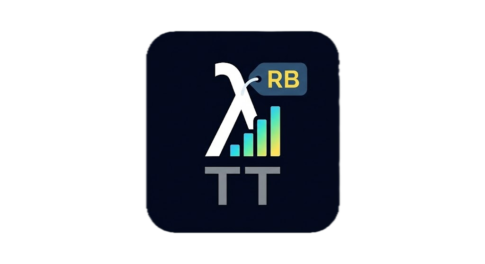

# RB-TT — Resource-Bounded Type Theory



Resource-Bounded Type Theory (RB-TT) is a small typed λ-calculus for **compositional cost analysis**.

Terms are typed with synthesized bounds drawn from an abstract **resource lattice**  
\((L, \preceq, \oplus, ⊥)\), and a graded **feasibility modality** □ᵣ tracks which programs are
admissible under a given resource budget.

The mathematical development is described in the companion paper `RBTT.pdf`.  
This repository contains the **Lean 4 implementation of the core syntax, typing,
and cost infrastructure**, plus **example programs** (e.g. binary search).  
The main metatheorems are currently **stated but not yet fully proved** in Lean.

---

## What's in this repo (current status)

- ✅ **Core calculus definitions**
  - Resource contexts (`ResCtx`) and lattice structure
  - Types, terms, and typing judgment `Γ ⊢[R;b] t : A`
- ✅ **Operational cost infrastructure**
  - Small-step semantics with step counting
  - Multi-step evaluation with accumulated cost
- ✅ **MLTT Extension (NEW - Phase 1 Complete)**
  - Full Martin-Löf Type Theory with TRUE dependent types
  - Extrinsic typing approach: Π, Σ, Nat, Vec, Bool, Id types
  - Complete capture-avoiding substitution (shift, subst)
  - See [ExtrinsicMLTT.lean](src/RBTT/Core/ExtrinsicMLTT.lean) and [examples](src/RBTT/Examples/DependentTypeExamples.lean)
  - Phase 2 scaffolding: [SubstitutionLemmas.lean](src/RBTT/Core/SubstitutionLemmas.lean)
  - Status and roadmap: [MLTT_STATUS.md](MLTT_STATUS.md)
- ✅ **Example programs**
  - Fuel-based binary search and other small examples
  - Dependent type examples demonstrating MLTT features
- 🟡 **Theorem statements (work in progress)**
  - Type soundness (progress + preservation)
  - Cost soundness ("typed bound ≥ operational cost")
  - Recursive bounds and binary search complexity
- 🟡 **Presheaf-style semantics scaffolding**
  - Basic presheaf and natural transformation definitions in Lean
  - Proof obligations and laws are marked with `sorry` and TODO

> **Implementation Status**: Definitions and type system are implemented. Many metatheorem proofs
> are axioms or `sorry` stubs (tracked in [PROOF_DEBT.md](docs/PROOF_DEBT.md)). See status sections below.

### 🎉 Recent Progress: MLTT Implementation (2026-01-10)

RB-TT has been extended with **full Martin-Löf Type Theory (MLTT)** featuring TRUE dependent types:

- **Type Constructors**: Π-types, Σ-types, Nat, Vec, Bool, Id (with real dependency)
- **Extrinsic Typing**: `HasType Γ e A` judgment with capture-avoiding substitution
- **TRUE Dependency**: Application returns `B[a]`, not just `B` - real substitution in types
- **Eliminators**: `natrec` for natural numbers with dependent motives
- **Working Examples**: Length-indexed vectors, dependent pairs, type families

**Phase 1 Complete**: Full MLTT syntax and typing with substitution (~630 lines)
**Phase 2 Scaffolding**: Substitution lemmas declared, proofs in progress

See [MLTT_STATUS.md](MLTT_STATUS.md) and [ExtrinsicMLTT.lean](src/RBTT/Core/ExtrinsicMLTT.lean) for complete details.

**Note**: RB-TT cost integration (Phase 4) is planned but not yet implemented.

---

## Features (mathematical side — see the paper)

- **Abstract resource lattice**  
  Treat time, steps, gas, memory, or domain-specific quantities uniformly via  
  \((L, \preceq, \oplus, ⊥)\).

- **Graded feasibility modality `□ᵣ`**  
  Express that a computation is feasible under budget `r`, with counit and
  monotonicity laws.

- **Compositional cost bounds**  
  Typing rules synthesize bounds `b` for terms; application, pairing, conditionals,
  etc. combine bounds via `⊕` and lattice joins.

- **Syntactic and semantic soundness (on paper)**  
  The paper proves type soundness, cost soundness, and a presheaf model in `Set^L`.
  These theorems are currently **not fully mechanized** in Lean.

---

## Getting started (Lean)

### Prerequisites

- [Lean 4](https://leanprover.github.io/) (matching the version in `lean-toolchain`)
- Lake (Lean’s build tool, included with recent Lean 4 installs)
- A recent `git`

Optional but recommended:

- VS Code + Lean 4 extension.

### Clone and build

```bash
git clone https://github.com/CoreyThuro/RB-TT.git
cd RB-TT

# Fetch dependencies and build
lake build
```

Open the folder in VS Code and let the Lean extension index the project.

---

## Repository layout

- `RBTT.pdf` – main paper (the canonical specification of the theory).
- `src/`
  - `RBTT/Res.lean` — resource contexts and basic operations
  - `RBTT/Core.lean`, `RBTT/Core/STLC.lean` — syntax and typing for STLC
  - `RBTT/Core/OpCost.lean` — small-step semantics and cost (with TODO theorems)
  - `RBTT/Core/ExtrinsicMLTT.lean` — ✅ Full Martin-Löf Type Theory with TRUE dependent types
  - `RBTT/Core/SubstitutionLemmas.lean` — 🔄 Phase 2 scaffolding: substitution correctness lemmas
  - `RBTT/Examples/BinarySearch.lean` — binary search implementation (STLC)
  - `RBTT/Examples/DependentTypeExamples.lean` — ✅ dependent type examples (MLTT)
  - `RBTT/Experimental/RecursionFuel.lean` — 🧪 fuel-based recursion (exploratory, not in paper)
  - `RBTT/Semantics/PresheafSet.lean` — presheaf semantics scaffold with `sorry`s
- `docs/` – documentation assets and status tracking
  - `rbtt-logo.svg` — project logo
  - `PROOF_DEBT.md` — tracking all `sorry` and `axiom` instances with proof plans
  - `MLTT_STATUS.md` — MLTT implementation status and roadmap
  - `DEPENDENT_TYPES_GUIDE.md` — user guide for dependent types
  - `MLTT_IMPLEMENTATION_COMPLETE.md` — technical details of MLTT implementation
  - `_archive/` — historical design documents (superseded)
- `.github/` – CI config (budget checks, etc.).
- `lakefile.lean`, `lake-manifest.json`, `lean-toolchain` – Lake / Lean project files.

---

## Using RB-TT as a Lean dependency

If you want to experiment with RB-TT inside another Lean 4 project:

1. Add this repository as a Lake dependency in your `lakefile.lean`:

   ```lean
   package myproj

   require rbt t from git
     "https://github.com/CoreyThuro/RB-TT.git"
   ```

2. Run:

   ```bash
   lake update
   lake build
   ```

3. Import the relevant modules, e.g.

   ```lean
   import RBTT.Core         -- syntax + typing
   import RBTT.Core.OpCost  -- cost semantics (with TODO theorems)
   ```

---

## License

This project is licensed under the **MIT License**.  
Please see the `LICENSE` file for the full text.

---

## Citing

If you use RB-TT in research, please cite the accompanying paper:

> Mirco A. Mannucci, Corey Thuro. *Resource-Bounded Type Theory:  
> Compositional Cost Analysis via Graded Modalities*, 2025.  
> (See `RBTT.pdf` in this repository.)

